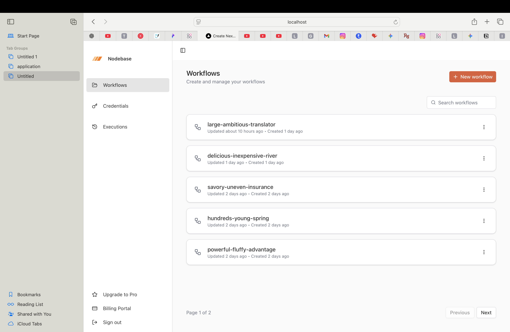
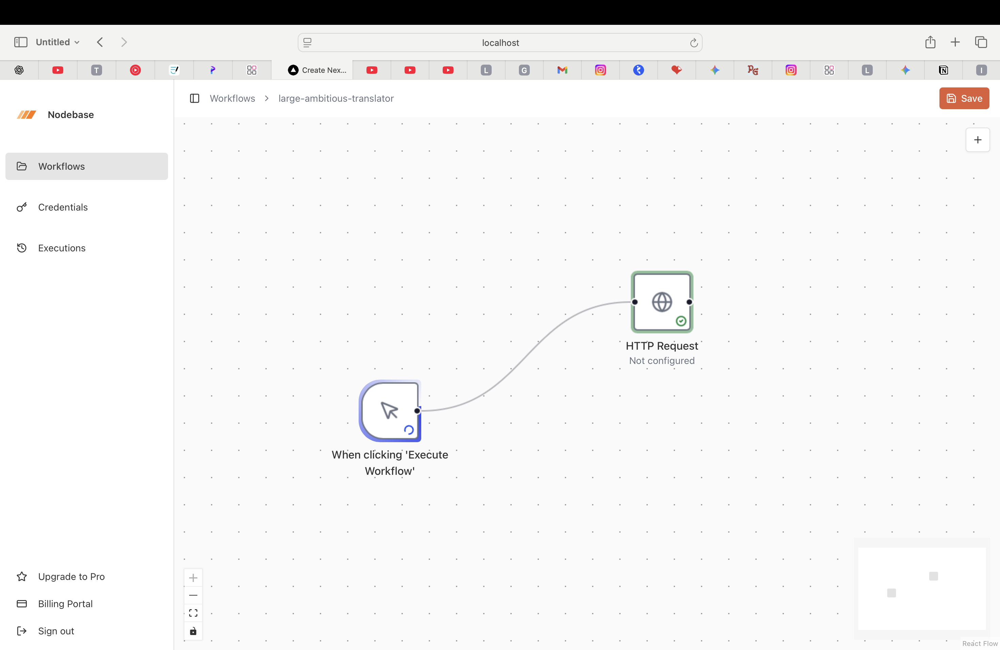

# Nodebase ⚙️  
**An n8n-inspired workflow automation platform**

Nodebase is a modern, developer-first workflow automation platform inspired by n8n.  
It enables users to build, execute, and monitor automated workflows using **trigger nodes**, **execution nodes**, and **AI-powered integrations** — all through a clean, extensible architecture.

---

## 🚀 Features

- **Visual Workflow Builder**
  - Node-based architecture inspired by n8n
  - Connect trigger nodes to execution nodes
  - Extensible node system for future integrations

- **Trigger Nodes**
  - Webhook triggers
  - Scheduled (cron-based) triggers
  - External event triggers (e.g. form submissions, API events)

- **Execution Nodes**
  - API calls (REST-based execution)
  - Data transformation & conditional logic
  - AI-powered processing nodes (LLM-based)

- **AI Integration**
  - AI nodes for summarization, classification, and data enrichment
  - Supports prompt-based dynamic execution
  - Designed to plug in multiple AI providers

- **Workflow Execution Engine**
  - Orchestrates node execution in sequence
  - Persists execution state and logs
  - Handles retries and failures gracefully

- **Type-safe API Layer**
  - End-to-end type safety using tRPC
  - No REST boilerplate between frontend and backend

- **Authentication & Authorization**
  - Secure user authentication
  - Workflow ownership and access control

---

## 📸 Product Preview

> A quick look at how workflows are designed, executed, and monitored in Codebase.

### 🧩 Workflow Builder
Drag-and-drop nodes to design automation flows with triggers and execution logic.



---

### ⚡ Trigger Configuration
Configure webhook, schedule, or event-based triggers with dynamic inputs.


---

### 🧠 AI Execution Node
AI-powered nodes that process data using prompt-based instructions.


---

### ▶️ Workflow Execution
Run workflows manually or automatically and track execution progress in real time.



---

### 📊 Execution Logs & Debugging
Inspect node-level execution logs, inputs, outputs, and errors.


## 🛠️ Tech Stack

### Frontend
- **React.js**
- **Next.js (App Router)**
- **Tailwind CSS**
- **React Flow** (for node-based UI)

### Backend
- **Next.js API / Server Actions**
- **tRPC** – fully type-safe API
- **Prisma ORM**

### Database
- **PostgreSQL**
- **NeonDB** (serverless Postgres)

### AI & Integrations
- OpenAI / LLM providers (pluggable)
- Webhooks & external APIs

---

## 🧠 System Design Overview

```txt
Trigger Node → Execution Engine → Execution Nodes → AI Processing → Output
